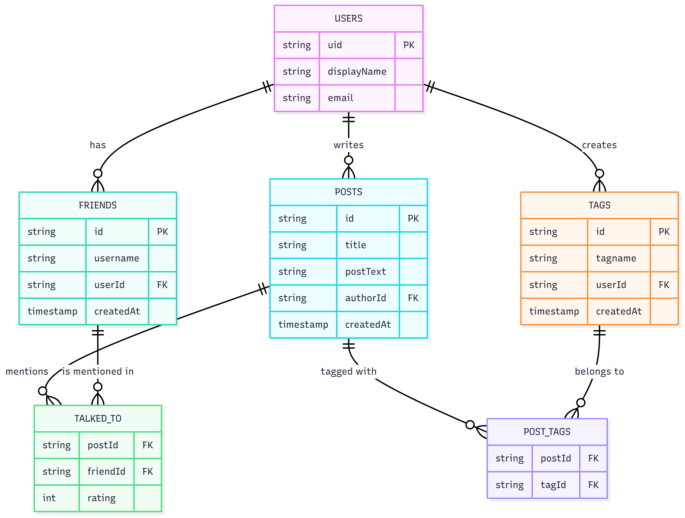

 

## アプリの URL

ゲストログイン機能を実装しましたので、登録せずにお試しいただくこともできます。

https://episode-talk-management.web.app/

 

 

## アプリ概要

本アプリは、エピソードトークを記録し「誰に話したか」を管理できるサービスです。
複数人が集まる場で、まだ誰にも話していない新鮮なエピソードを提供できます。

 

### 主な機能

- Google アカウント / ゲストによるログイン
- エピソードトークの登録（タイトル・本文）
- 「話した相手」の記録
- 複数の友人を選択して、「まだ話していないエピソード」を検索
- エピソードのおもしろさを評価（⭐️）
- タグによる検索機能

 

## 開発背景

<!-- ## このアプリを作った理由 -->

日常の会話において「同じ話を繰り返してしまう」「誰にどの話をしたか分からなくなる」といった課題を解決するために開発しました。

 

<!-- ## 機能説明

- ログイン画面
- 友達追加
- エピソード登録
- エピソード検索

  -->

## 機能一覧

| ログイン画面 | 　ともだち画面 |
| ---------- | -------------- |
|  |  |
| 登録せずにサービスをお試しいただくためのゲストログイン機能を実装しました。 | ともだちの追加や削除ができます。 |

| エピソードトーク追加画面 |　エピソードトーク一覧画面 |
| ---- | ---- |
|  |  |
| 新しくエピソードトークが追加できます。 | 追加したエピソードトークを確認できます。また、編集や削除ができます。 |

| エピソードトーク検索画面 |　エピソードトーク編集画面 |
| ---- | ---- |
|  |  |
|　「まだ話していない友達」や「タグ」でフィルターをかけてエピソードトークを検索できます。 | エピソードトークを編集できます。話した友達と評価やタグを選択できます。 |

| タグ画面 |　ログアウト編集画面 |
| ---- | ---- |
|  |  |
|　「タグ」の追加や削除ができます。 | ログアウトできます。 |

 

## 主な使用技術

- **フロントエンド**: React / JavaScript / TailwindCSS / Vite
- **認証**: Firebase Authentication
- **データベース**: Firestore
- **デプロイ**: Firebase Hosting

 

## ローカル起動

`npm install`

`.env.example` を参考に `.env` を作成し、Firebase の設定値を入れてください。

`npm run dev`

 

## ER 図

 

<!-- ## インフラ構成図 -->

<!--   --> 

## 今後の展望

- UI/UX の改善
- サーバーサイドの実装
- 友人検索機能の追加
- 評価機能の拡張
- キーワード検索機能の追加
